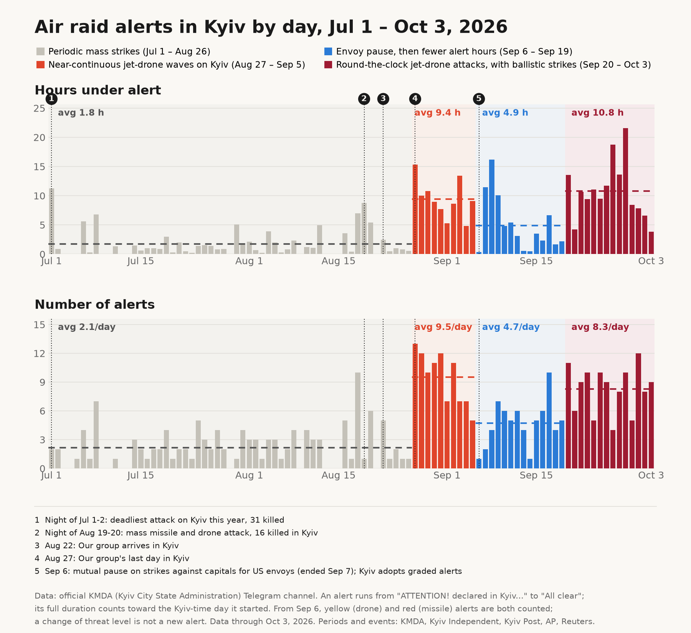

# Russia's War of Terror: Kyiv air raid alerts

Counts air raid alerts in Kyiv from the official KMDA (Kyiv City State Administration)
Telegram channel and charts them by day, Jul 1 – Oct 3, 2026.



## How alerts are counted

- **Source:** a Telegram Desktop JSON export of the channel "КМДА – офіційний канал"
  (`result.json`).
- **Start of an alert:** any post containing `УВАГА! У Києві оголошена` ("ATTENTION! ...
  declared in Kyiv"). From Sep 6, 2026 Kyiv uses graded alerts (drone danger, missile
  threat), and all of them match this pattern.
- **End of an alert:** a post containing `Відбій повітряної тривоги` ("All clear").
- **Pairing:** each start is paired with the next all-clear. A start posted while an alert
  is already open (a "нова загроза" / "new threat" level change) is not a new alert. An
  alert with no all-clear by the end of the window is dropped.
- **Days:** timestamps come from `date_unixtime`, converted to Europe/Kyiv time. The
  export's `date` field is not used because it holds the exporting machine's local time.
  Each alert's full duration counts toward the Kyiv day it started.

## Files

| File | What it is |
|------|------------|
| `build_daily.py` | Parses `result.json`, pairs alerts, writes the daily table and prints checks |
| `make_chart.py` | Bar chart of hours under alert and alerts per day, coloured by period |
| `make_chart_calendar.py` | Calendar view: one cell per day, shaded by hours under alert |
| `make_chart_clock.py` | 24-hour view: one column per day showing when each alert ran |
| `make_chart_timeofday.py` | Share of time under alert by time of day (night, morning, working hours, evening) per period |
| `result.json` | Telegram Desktop JSON export of the KMDA channel (~40 MB) |
| `daily_alerts.csv` | One row per day: `date`, `count` (alerts started), `hours` (under alert) |
| `kyiv_air_alerts*.png` | Chart outputs |
| `reference.png` | Earlier version of the bar chart (by month, through Sep 28) |

The date window is set by `START_DATE` and `END_DATE` in `build_daily.py`. Periods and
annotated events shared by all three charts are defined in `PERIODS` and `EVENTS` in
`make_chart.py`.

## Usage

Requires Python 3.13+ and [uv](https://docs.astral.sh/uv/).

```sh
uv sync
uv run build_daily.py result.json daily_alerts.csv
uv run make_chart.py daily_alerts.csv kyiv_air_alerts.png
uv run make_chart_calendar.py daily_alerts.csv kyiv_air_alerts_calendar.png
uv run make_chart_clock.py result.json daily_alerts.csv kyiv_air_alerts_clock.png
uv run make_chart_timeofday.py result.json kyiv_air_alerts_timeofday.png
```

`build_daily.py` prints checkpoint figures to verify the parse: how many posts matched
each rule, the skipped level-change starts by headline, the shortest and longest alerts,
monthly means, and the Aug 27 – Sep 28 averages compared with July.

The charts use IBM Plex Sans if it is installed and fall back to DejaVu Sans.

To update the data, export the channel from Telegram Desktop as JSON (Export chat history
→ Format: JSON), replace `result.json`, adjust `END_DATE` and the period/event lists if
needed, and rerun the commands above.

## Development

```sh
uv run ruff check
uv run ruff format --check
uv run ty check
```
